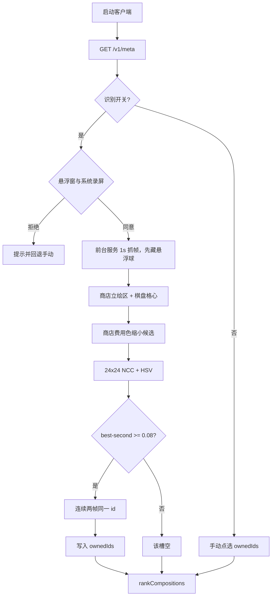

# 实时识别与 AI 推荐（架构 + 测试用例）

> 域：screenRecognize | 日期：2026-09-04 | 状态：精准快速识别 P0

## 关联文档

| 文档 | 路径 |
|------|------|
| PRD | [实时识别与AI推荐.md](../../PRD/实时识别与AI推荐.md) |
| 表与三方 | [实时识别与AI推荐-表与三方接口.md](../../database/实时识别与AI推荐-表与三方接口.md) |
| 识别流程 | [棋盘识别管理.md](../../features/棋盘识别管理.md) |

## 背景

授权 `MediaProjection` 抓帧后，用 CDragon/本地头像模板匹配商店与棋盘。12×12 去均值 SAD 会把同费用相似立绘认错。P0 改为 24×24 NCC + HSV + 费用色先验 + 近邻拒绝 + 两帧投票。职责外：读内存、反作弊对抗、默认把截图送给 Vision。

## 完整流程图



## 包结构

```
packages/meta-schema     Champion.fingerprint 默认 []
packages/screen-match    24x24 NCC / HSV / 费用先验 / 帧投票
apps/crawler             data/portraits 重算指纹
apps/mobile              Expo + modules/jcc-screen-recognize
```

## 测试用例

### 影响因素（Fx）

| 因子 | 是/符合 | 否/不符合 |
|------|---------|-----------|
| F1 bundle 含指纹 | 24×24 长度合法 | fingerprint=[] |
| F5 录屏授权 | 用户同意 | 拒绝 |
| F6 近邻可分 | best-second ≥ 0.08 | 近邻拒绝 |
| F8 费用先验 | 商店 costHint 命中 | 无 hint，全图鉴匹配 |
| F9 两帧一致 | 同槽同 id | 首帧或跳变，不写 ownedIds |

### 全场景矩阵

| 用例ID | F1 | F5 | F6 | F8 | F9 | 判断/断言 | 日期 |
|--------|----|----|----|----|----|-----------|------|
| TC-R01 | 否 | 是 | any | any | any | 不自动勾选，提示无指纹 | 2026-09-04 |
| TC-R02 | 是 | 否 | any | any | any | 回退手动点选 | 2026-09-04 |
| TC-R03 | 是 | 是 | 否 | any | any | 该槽 id 为空 | 2026-09-04 |
| TC-R04 | 是 | 是 | 是 | 是 | 否 | 首帧不写 ownedIds | 2026-09-04 |
| TC-R05 | 是 | 是 | 是 | 是 | 是 | ownedIds 含该棋子 | 2026-09-04 |
| TC-R06 | 是 | 是 | 是 | 是 | 是 | 跨费用候选被丢掉 | 2026-09-04 |

### UT

- `@jcc/screen-match`：同图高 NCC、镜像可分、近邻拒绝、费用先验、两帧投票、原生 id 直通
- crawler：肖像 PNG 写入 24×24 指纹；缺目录空操作

## 待执行步骤

- [x] P0 24×24 NCC + HSV + 费用先验 + 帧投票
- [ ] P1 真机商店 5 格走查
- [ ] P2 商店中文名 OCR / 六边形站位 / 装备 / Vision
